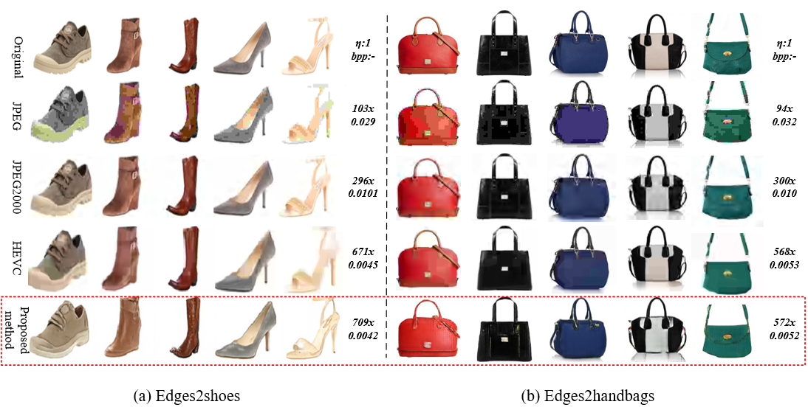
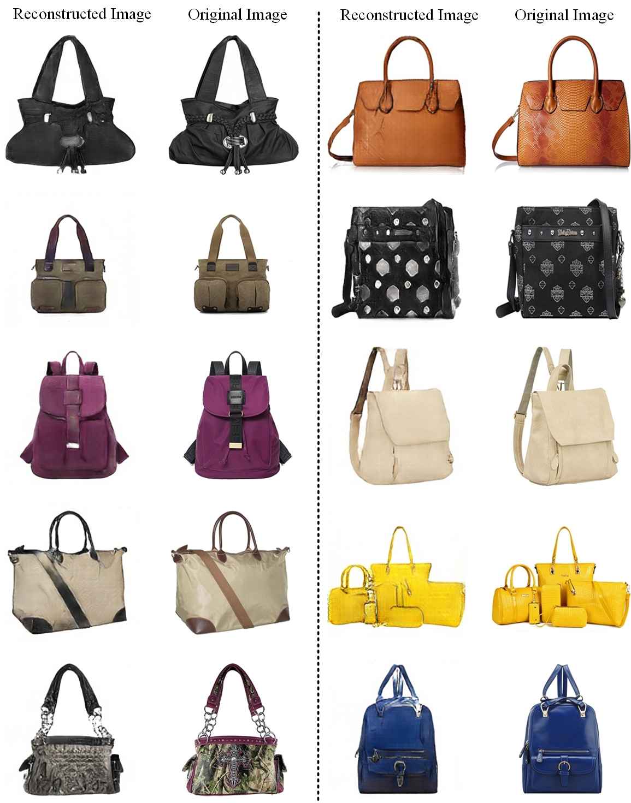

# Layered Conceptual Image Compression Via Deep Semantic Synthesis

The implementation of the conception compresssion framework proposed in the paper <a href="https://hpc.pku.edu.cn/docs/pdf/a20191230179.pdf">Layered Conceptual Image Compression Via Deep Semantic Synthesis (ICIP 2019)</a>.

## Framework Pipeline

The pipeline of the proposed framework are shown above.

## Results

The proposed method demonstrate better perception quality under lower bit rate than traditional algorithms such as JPEG\JPEG2000\HM.

## Dependencies

``python >= 3.6``   
``pytorch >= 1.14``   
``numpy >= 1.18``   
``pillow >= 6.2.0``   
``dominate >= 2.5``   
``visdom >=0.1.8``   
``tqdm >= 4.36.1``   

## Prepare Data
Prepare paired data(image-edge pairs):
Training datasets include the following datasets, please download one of the following training datasets, and unzip the files.

1. edges2handbags:  http://efrosgans.eecs.berkeley.edu/pix2pix/datasets/edges2handbags.tar.gz
2. edges2shoes: http://efrosgans.eecs.berkeley.edu/pix2pix/datasets/edges2shoes.tar.gz

## Training command
You can follow the examples in ./scripts/train.sh.
``python train.py --dataroot=[path of training data] --phase=[name of datasets: train/val/test] --nz=[dimension of latent codes]``

## Testing command
Please follow the examples in ./scripts/test.sh
``python test.py --dataroot=[path of testing data] --results_dir=[path where you put the results images] --checkpoints_dir=[checkpoints_dir] --no_flip --epoch=[name of checkpoints: default latest]``

## Pretrained model
You can find the pretrained model which is trained 80 epochs with combined dataset of edges2shoes and edges2handbags.
The dimension of texture latent codes is set to 64.

- Pretrained model: https://disk.pku.edu.cn:443/link/07FC94DAC259C9AEC85ADEC747A8BC3E

## Reconstrution examples
There are some reconstruction examples of the provided pretrained model.

